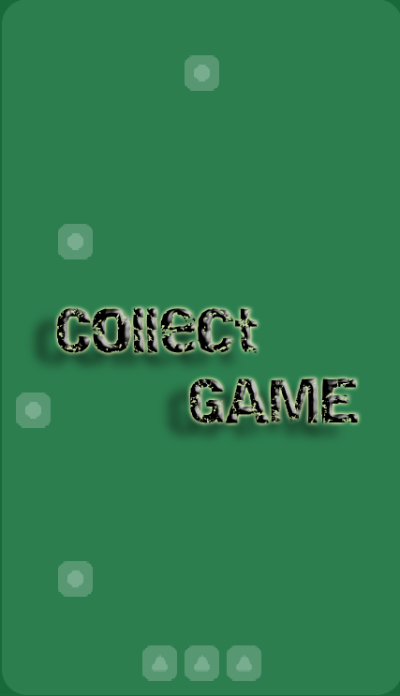

## I. About The Project
### Game final project for the IU' 2023 Data Structure & Algorithms course.
- The "Collect Game" – the ultimate game of skill and precision!
- In this fast-paced and entertaining challenge, players take on the role with collecting falling blocksfrom the sky. The goal is simple: catch as many blocks as possible
- Players navigate through a colorful and dynamic environment where blocks rain down at varying speeds. Each successfully caught block adds to your score, but beware – let one slip, and you will losing valuable points. The game's engaging mechanics and vibrant graphics create an immersive experience that keeps players hooked and coming back for more.

## Collect Game

## II. My Team 
### Group 1
| Student's ID | Full Name      |
|--------------|----------------|
| ITDSIU21109  | Trần Bảo Phúc  |
| ITDSIU21096  | Hoàng Văn Long |
| ITDSIU21012  | Phan Danh Đức  |
| ITDSIU21101  | Nguyễn Nam     |

## III. Getting Started

### Prerequisites

* Windows 10 or 11
* ***For development:***
    * [IDE: IntelliJ IDEA](https://www.jetbrains.com/idea/download/#section=windows)
    * [JDK version: JDK 19(2) or 19.0.2](https://www.oracle.com/java/technologies/javase/jdk19-archive-downloads.html)
    * [Git](https://git-scm.com/downloads)

### Installation
* Project Link: [Github](https://github.com/DSBaoPhuc/DSA-ProjectGame.git)
* Clone the repo

## IV. Usage

### To play

1. Open folder "DSA-ProjectGame"
2. src -> main package -> Launcher.java -> Run

### Demo
* [Demo Video](https://drive.google.com/file/d/1jdtFAZ6KCboY9iEuIqM84btHXIpnPJn2/view?fbclid=IwAR2sByOTQNSxDmhq2BOqw5Ay_iGtBjU_z12cCq-lyts2cqM29ctMeSlDA74)

### Class Diagrams
* [General UML](https://drive.google.com/file/d/1OXPh8VQaYmViyyPPb4I-Vn-wW-sAOANd/view?usp=sharing)
* [Specific UML](https://drive.google.com/drive/folders/1XQjfDdlJzKVDPU74ppyN-yjmz8gJbJ_w?usp=sharing)

### Chart Rule
* [Game Chart Rule](https://drive.google.com/file/d/1jYwAI4ZNG0NPXF9Q8yDdB2Qj03biNWb8/view?usp=sharing)

## V. Contact

Tran Bao Phuc : [Facebook](https://www.facebook.com/baophuclyk18.cla/)
- Gmail: baophuc.itds.hcmiu@gmail.com
- Edu: ITDSIU21109@student.hcmiu.edu.vn

(<a href="#readme-top">back to top</a>)

